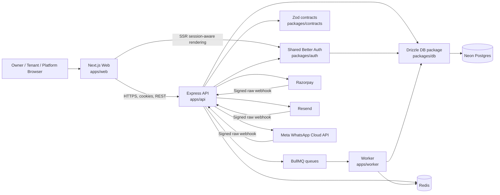

# Implementation Plan — PGKhata V1

## Problem statement

Build a new, production-oriented PGKhata V1 at repository root `pgkhata_v1/`, preserving the mature product scope documented in the existing architecture while replacing Supabase/TanStack Start with a redesigned **Next.js + Express modular monolith**. V1 must support real Razorpay, Resend, and Meta WhatsApp integrations, with Neon Postgres, Redis/BullMQ, Drizzle, Better Auth, and operational deployment controls.

## Confirmed requirements

- **Location and reference documents:** create `pgkhata_v1/` beside `PG Manager Pro/`; move the supplied architecture documents into `pgkhata_v1/data-points/`.
- **Workspace:** Turborepo + pnpm monorepo.
  ```text
  pgkhata_v1/
  ├── apps/
  │   ├── web/               # Next.js App Router
  │   ├── api/               # Express 5 REST API
  │   └── worker/            # BullMQ worker process
  ├── packages/
  │   ├── auth/              # Better Auth configuration and session helpers
  │   ├── db/                # Drizzle schema, migrations, Neon access
  │   ├── contracts/         # Zod schemas, API contracts, shared types
  │   ├── config/            # TypeScript, lint, environment configuration
  │   └── ui/                # Reusable product UI primitives
  ├── data-points/
  ├── package.json
  ├── pnpm-workspace.yaml
  ├── turbo.json
  └── README.md
  ```
- **Framework initialization:** use official CLIs—especially `pnpm dlx create-next-app@latest apps/web`—to generate Next.js files. Do not manually recreate or imitate the generated Next.js starter structure.
- **Frontend:** redesign around pragmatic owner operations on desktop and mobile: see dues → create/review bills → record collections → send reminders → manage occupancy and complaints.
- **Backend:** TypeScript, Express 5, Zod, Pino, Helmet, strict CORS, Redis-backed rate limiting, Drizzle, Neon Postgres, BullMQ, Resend, Razorpay, and Meta WhatsApp Cloud API.
- **Authentication:** Better Auth owns credentials and session lifecycle. Do not add a parallel custom JWT/refresh-token implementation; use Better Auth secure sessions and server-side validation.
- **Scope:** full parity for owner operations, public tenant flows, billing/payment ledger, reminders, subscriptions/coupons/Razorpay, reports, KYC, complaints, and MFA-gated super-admin capabilities.
- **Operations:** include Docker, environment separation, secret management, health checks, structured logging, migrations/rollback, Neon branches/recovery, job draining, CI/CD, abuse protection, domain strategy, and cost-conscious hosting.

## Research findings and design implications

- Mount Better Auth’s Express handler before JSON body parsing. For Express 5, use the `*splat` catch-all route. Domain routes validate the incoming Better Auth session through its server API.
- Use Drizzle with a `node-postgres` pool for the long-running API and worker where transactions and connection semantics matter. Use protected Neon production branches and short-lived schema-only/expiring preview branches; never use production data in ordinary previews.
- Use BullMQ `upsertJobScheduler` for idempotent recurring work, explicit retry/backoff policies, unique domain idempotency keys, and `worker.close()` for graceful shutdown.
- Verify Razorpay `X-Razorpay-Signature` using HMAC-SHA256 over the exact raw request body. Persist and deduplicate `x-razorpay-event-id`; allow for duplicate and out-of-order events.
- Verify Resend webhook signatures over the raw payload. Verify Meta WhatsApp `X-Hub-Signature-256` against raw payload before processing delivery or inbound events.
- Deploy containers behind a reverse proxy/load balancer instead of exposing Next.js directly. Keep runtime secrets server-only; use `NEXT_PUBLIC_*` only for explicitly safe browser values.
- Better Auth’s Drizzle-specific documentation should be revalidated at implementation time. Pin compatible Better Auth/Drizzle versions, generate the Better Auth schema through its supported CLI, and incorporate the result into Drizzle-owned migrations rather than depending on unverified third-party patterns.

## Proposed architecture



### Core boundaries

- **`apps/web`:** Next.js App Router application for product UI, SSR-safe route protection, browser state, accessibility, and API-client consumption. It does not access Neon directly.
- **`apps/api`:** authoritative REST API and webhook receiver. It owns authentication enforcement, authorization, business rules, transactions, queues, provider integrations, and OpenAPI/API documentation.
- **`apps/worker`:** separately deployable BullMQ process, but not a microservice. It consumes billing, reminder, delivery, plan-lifecycle, report/export, and retryable-side-effect jobs.
- **`packages/auth`:** one Better Auth configuration, database adapter/schema, cookie/session settings, user-role helpers, and MFA configuration. Express mounts the handler; Next.js consumes client/session utilities.
- **`packages/db`:** one Drizzle schema and migration history. All tenant-owned writes include owner scope; compound unique constraints and transactions enforce financial invariants.
- **`packages/contracts`:** shared Zod request/response schemas, typed API contracts, domain enums, pagination/filter schemas, and webhook payload normalization types.

### Authentication and tenancy model

- Better Auth uses secure, HttpOnly, `Secure`, and appropriate `SameSite` cookie sessions with database-backed session records. Redis may provide secondary storage for short-lived verification and rate-limit state.
- Deploy web/API under compatible subdomains such as `app.pgkhata.com` and `api.pgkhata.com`, with explicit credentialed CORS and cookie-domain configuration. Local development uses a proxy or consistent-origin approach.
- Server-owned roles include `owner`, `super_admin`, and required support roles. Clients must never set or elevate a role.
- Every owner-scoped repository/service operation accepts the authenticated owner ID and verifies the ownership chain. Cross-owner isolation tests are mandatory for privileged routes.
- Super-admin functions require membership, TOTP MFA, current assurance, and append-only audit records. Owner and platform-console experiences remain separate.

### Domain model and invariants

```text
Better Auth user
  ├── owner_profile
  │   └── properties → rooms → tenants → bills → payments
  │                            ├── electricity_readings
  │                            ├── complaints
  │                            └── notification_logs
  └── super_admin membership / MFA / audit log

settings, scheduled_reminders, public-link tokens,
plan_payments, plan_change_history, coupons, coupon_redemptions
```

Critical business rules:

1. Billing is idempotent through a unique `(tenant_id, bill_month)` constraint and transaction-safe generation.
2. Payments are the source of truth; bill paid amount, balance, timestamp, and status derive from payment-ledger records.
3. Billing includes active tenants only; tenant rent override precedes room rent; property electricity rate precedes owner default; room usage is evenly split among active occupants.
4. Scheduled billing creates reviewable drafts; owner approval precedes external notification.
5. Public signup/complaint links resolve property/owner identity from active unguessable tokens, never client-provided identifiers.
6. Provider webhooks are raw-body verified, deduplicated, idempotent, and auditable.
7. KYC/photo storage uses a provider-neutral S3-compatible abstraction with short-lived signed access. Sensitive documents are never public by default.

## Task breakdown

### Task 1 — Initialize the CLI-owned monorepo foundation and preserve reference data

**Objective:** Create `pgkhata_v1/` with pnpm/Turborepo conventions, move the three reference documents to `data-points/`, and initialize `apps/web` only through the official Next.js CLI.

**Implementation:** Pin dependencies; initialize workspace root, Turbo pipelines, manifests, and shared TypeScript/lint/format rules. Run `pnpm dlx create-next-app@latest apps/web` with TypeScript, App Router, Tailwind, ESLint, `src/`, and pnpm. Add minimal API/worker/package manifests without manually fabricating Next.js-generated files. Add a concise README.

**Tests:** Verify workspace package discovery, Turbo task graph, generated Next.js lint/typecheck/build, and root formatting/lint/typecheck commands.

**Demo:** `pnpm dev` launches the generated app; the documented monorepo layout and source data points are present.

### Task 2 — Establish shared configuration, observability, API skeleton, and local runtime dependencies

**Objective:** Deliver a running Express API, worker skeleton, Redis connectivity, configuration validation, health/readiness endpoints, and structured logs.

**Implementation:** Create typed Zod environment schemas separated by web/API/worker. Configure Pino request IDs/redaction, error normalization, Helmet, allow-list CORS with credentials, Redis-backed rate limiting, request-size limits, `/health`, and dependency-aware `/ready`. Add Dockerfiles, development Compose for Redis, and graceful API/worker shutdown.

**Tests:** Unit-test invalid configuration, CORS/rate limits, error shape, Pino redaction, and `SIGTERM` shutdown. Add Supertest API smoke tests.

**Demo:** Web, API, worker, and Redis start locally; health/readiness and redacted structured logs work.

### Task 3 — Build Neon/Drizzle persistence, migration discipline, and Better Auth integration

**Objective:** Establish one database/migration source of truth and secure registration, sign-in, sign-out, and session retrieval across Next.js and Express.

**Implementation:** Configure Drizzle with a long-lived `node-postgres` pool. Generate Better Auth schema through the supported CLI and integrate it into Drizzle migrations. Mount Better Auth before JSON parsing. Configure Next client/SSR checks, credential login, verification/reset email via Resend, role-safe owner profile provisioning, secure cookies, and Redis secondary storage where suitable.

**Tests:** Run migration smoke tests on isolated Neon/test databases. Test registration, login, invalid credentials, logout, expired/revoked sessions, protected API access, and role escalation prevention.

**Demo:** An owner signs up, signs in, accesses a protected empty dashboard and `/v1/me`, signs out, and loses access in both web/API contexts.

### Task 4 — Deliver operational shell, authorization framework, and property/room inventory

**Objective:** Create the owner application structure and owner-scoped property/room management.

**Implementation:** Create responsive navigation, property switcher, keyboard-friendly tables/forms, loading/empty/error states, mobile drawer, and accessible UI tokens. Add owner authorization middleware and scoped repositories. Implement property configuration, unique room numbers per property, capacity, rent, electricity mode/rate override, and plan-limit guard framework.

**Tests:** Cover authentication, cross-owner isolation, validation, room uniqueness, capacity/limit errors, and property deletion behavior; add component tests for navigation and form states.

**Demo:** An owner creates/selects properties and manages rooms. A second owner cannot access that inventory.

### Task 5 — Implement tenant, KYC, and occupancy management

**Objective:** Support full tenant lifecycle management with private KYC artifacts and correct occupancy.

**Implementation:** Add tenant contact/identity data, Indian phone validation, rent overrides, dates, deposits, emergency contacts, notes, room assignment, status transitions, capacity checks, and search/pagination. Add private signed-upload/download KYC/photo storage with MIME/type/size validation and sensitive-access auditing.

**Tests:** Cover validation, capacity races, cross-owner access, vacating behavior, active occupancy, signed-upload authorization, and prohibited public KYC access.

**Demo:** An owner adds a tenant with KYC, reassigns or marks them vacating, and sees correct occupancy.

### Task 6 — Implement electricity readings and deterministic monthly billing

**Objective:** Generate reviewable, retry-safe monthly bill calculations.

**Implementation:** Add monotonic room-meter readings, baseline handling, effective rate calculation, monthly usage, a pure billing calculator, and transactional billing runs. Enforce all tenancy, rent/rate fallback, co-tenant allocation, due-date, and uniqueness rules.

**Tests:** Test calculator rules, rounding, no-reading baseline, multiple occupants, overrides, rate fallbacks, concurrent retry/idempotency, cross-owner isolation, and manual draft generation.

**Demo:** An owner records readings and generates accurate monthly drafts with visible allocation explanations; repeated generation does not duplicate bills.

### Task 7 — Complete bill review, approval, invoices, and payment ledger

**Objective:** Make billing operational: review/approve/issue bills, record/void payments, derive balances, and create invoices/receipts.

**Implementation:** Add bill filters, individual/batch approval, edit safeguards, issue/send states, and tenant ledgers. Keep payments as the only settlement authority; calculate bill status in database transactions. Generate authorized printable invoices/receipts and CSV exports. Never implement direct “mark paid” bill mutation.

**Tests:** Cover partial/overpayments, invalid payments, deletions/recalculation, due-date statuses, approvals, duplicates, receipt authorization, and concurrent ledger consistency.

**Demo:** Owner approves bills, records partial and final payments, sees derived statuses/balances, and downloads scoped documents.

### Task 8 — Build dashboard, collection reporting, and daily-work prioritization

**Objective:** Provide fast operational insight into dues, occupancy, complaints, reminders, and collections.

**Implementation:** Design dashboard around overdue collection, occupancy, current-month billing/collection, notification quota, and action queues. Add property-scoped analytics, period filters, trends, overdue aging, CSV export, server-side indexing, and paginated API queries.

**Tests:** Verify aggregates across properties/months/statuses, time-zone boundaries, empty data, plan-gated reports, exports, accessible filters, and mobile summaries.

**Demo:** Owner identifies actionable dues, changes property/month, drills into reporting, and exports an authorized collection view.

### Task 9 — Implement real email/WhatsApp notifications and reminders

**Objective:** Send auditable bills/reminders through Resend and Meta WhatsApp with real-provider staging support.

**Implementation:** Build provider adapters with environment validation, idempotency keys, notification logs, templates, retries, opt-in/phone checks, quota control, scheduled/manual/personal reminders, before-due/due/overdue policy, same-day deduplication, and overdue cooldown. Receive raw webhook bodies before parsing; verify Resend and Meta signatures and deduplicate events.

**Tests:** Cover reminder selection/cooldown/deduplication, templates, invalid/replayed/duplicate webhooks, provider failure, owner scope, and quotas. Run Resend/WhatsApp staging smoke tests with real approved/test credentials.

**Demo:** Owner sends/schedules a real reminder; verified webhook updates delivery state and safeguards prevent inappropriate repeats.

### Task 10 — Implement public tenant signup and complaint links

**Objective:** Provide public, minimal-disclosure property links without weakening isolation.

**Implementation:** Add regenerable/revocable/expiring signup and complaint tokens with audit data. Signup exposes only property name and vacant room labels; server validates capacity and creates an owner-scoped tenant. Complaints expose minimal property context and support open → in-progress → resolved states. Add strict validation, rate limits, honeypot/time checks, and non-enumerable responses.

**Tests:** Cover token expiry/revocation, no client-controlled owner/property IDs, disclosure limits, capacity races, cross-owner access, complaint authorization, and public abuse limits.

**Demo:** A public signup joins an available room, and a public complaint arrives in the correct owner queue without leaking unrelated data.

### Task 11 — Implement plans, coupons, Razorpay checkout, and lifecycle

**Objective:** Deliver PGKhata subscriptions, plan gates, coupons, checkout, renewals, upgrades/downgrades, proration, and receipts.

**Implementation:** Model plans, limits, state, payments, coupons/redemptions, history, and gates. Create Razorpay orders server-side; browser callback is convenience only. Treat signed raw-body webhooks as authoritative. Persist provider event IDs and atomically claim payment handling to prevent callback/webhook double application. Implement trial/grace/past-due states and scheduled downgrades.

**Tests:** Cover pricing, periods, proration, coupon restrictions, API/database limit enforcement, invalid/duplicate/out-of-order events, atomic payment application, and retry recovery. Run Razorpay Test Mode checkout/webhook smoke tests.

**Demo:** Owner redeems a coupon or completes Test Mode checkout; subscription activates exactly once, limits update, and receipt/history appear.

### Task 12 — Build BullMQ orchestration and asynchronous processing

**Objective:** Make async work reliable, observable, idempotent, and independently deployable.

**Implementation:** Create queues for billing, bill notification, reminders, plan lifecycle, provider retry, document/report work. Register recurring jobs through `upsertJobScheduler`; use India-time-zone-aware business dates, retry/backoff/dead-letter policy, unique domain keys, metrics, tracing, alerts, and graceful worker drain.

**Tests:** Cover idempotent enqueueing, retry exhaustion, failure recovery, duplicate scheduling, cron/time-zone behavior, drain behavior, and job reentrancy with controlled Redis clocks where practical.

**Demo:** Scheduled bills/reminders run via worker without blocking HTTP requests; operations can inspect job status, retries, and outcomes.

### Task 13 — Deliver MFA-protected super-admin console

**Objective:** Give platform operators an auditable console for owners, revenue, coupons, usage, health, broadcasts, and security.

**Implementation:** Require super-admin membership, TOTP MFA, and current assurance. Add append-only audits for sensitive actions, reason metadata for support access, minimized owner-data exposure, owner directory, coupon management, MRR/revenue, usage, health, broadcasts, and console-security controls.

**Tests:** Cover MFA enrollment/challenge/recovery, owner/non-MFA denial, immutable audit enforcement, support audits, coupon authorization, and MRR correctness.

**Demo:** A super-admin completes MFA, reviews health/MRR, creates a coupon, and produces an immutable audit event; an owner cannot reach the console.

### Task 14 — Harden deployment, environments, CI/CD, recovery, and security

**Objective:** Prepare repeatable dev/staging/preview/production deployment for web, API, and worker.

**Implementation:** Finalize multi-stage Docker images, Compose workflow, env templates, secrets policy, reverse proxy/HTTPS/domain routing, probes, logs, error tracking, and least-privilege credentials. Use protected Neon production branches and isolated expiring preview/test branches. Add CI for formatting, lint, typecheck, unit/API/component/E2E tests, builds, container smoke tests, staging deployment, and provider Test Mode validation. Write runbooks for queue failures, webhooks, migrations, Redis degradation, Neon recovery, credential rotation, and worker draining.

**Tests:** Validate builds, environment completeness, non-production migration apply/rollback rehearsals, CI, dependency-loss readiness, rate-limit/load smoke checks, backup/restore drill documentation, and staged end-to-end critical paths.

**Demo:** A clean environment deploys all three apps from CI, passes health checks, migrates safely, processes scheduled jobs, completes provider Test Mode, and follows rollback/recovery runbooks.

### Task 15 — Run end-to-end acceptance, security review, and launch readiness

**Objective:** Verify V1 matches the agreed scope and can release safely.

**Implementation:** Execute owner/public/super-admin journeys; verify accessibility, responsiveness, performance, error states, auditability, and legacy invariants. Review session/cookies, CORS, CSRF, isolation, webhook signatures, replay protection, KYC access, rate limits, secret redaction, and dependency licenses. Reconcile each legacy capability from `data-points` to a V1 route/API/job/test or explicitly document its deferral.

**Tests:** Run the complete monorepo suite, API integration, Playwright E2E, dependency/security scanning, migration verification, provider staging smoke tests, and owner/super-admin acceptance checklists.

**Demo:** Demonstrate onboarding → inventory → tenant/KYC → reading → bill → payment → reminder → report, plus public signup/complaint, subscription checkout, and MFA/audit flows in a production-like staging environment.

## Success criteria

- V1 has no Supabase dependency; state lives in Neon Postgres, Redis, object storage, or approved external providers.
- Next.js is CLI-initialized and Turborepo orchestrates the monorepo.
- Better Auth is the sole authentication/session authority; there is no competing custom JWT refresh layer.
- Owner data paths are authorization-scoped and covered by cross-owner isolation tests.
- Billing/payment-ledger invariants are transactional, idempotent, and tested.
- Razorpay, Resend, and WhatsApp use official verification mechanisms and real staging/Test Mode workflows.
- Worker jobs are retryable, idempotent, observable, and gracefully drained.
- Production deployment, migrations, secrets, monitoring, recovery, and CI/CD procedures are documented and validated.

## Official documentation to consult during implementation

- [Next.js installation](https://nextjs.org/docs/app/getting-started/installation)
- [Better Auth Express integration](https://www.better-auth.com/docs/integrations/express)
- [Better Auth Next.js integration](https://www.better-auth.com/docs/integrations/next)
- [Drizzle with Neon](https://orm.drizzle.team/docs/connect-neon)
- [BullMQ job schedulers](https://docs.bullmq.io/guide/job-schedulers)
- [BullMQ graceful shutdown](https://docs.bullmq.io/guide/workers/graceful-shutdown)
- [Razorpay webhook validation](https://razorpay.com/docs/webhooks/validate-test/)
- [Resend webhook verification](https://resend.com/docs/dashboard/webhooks/verify-webhooks-requests)
- [Meta WhatsApp webhooks](https://developers.facebook.com/docs/whatsapp/cloud-api/guides/set-up-webhooks)
- [Neon branch management](https://neon.com/docs/manage/branches)
